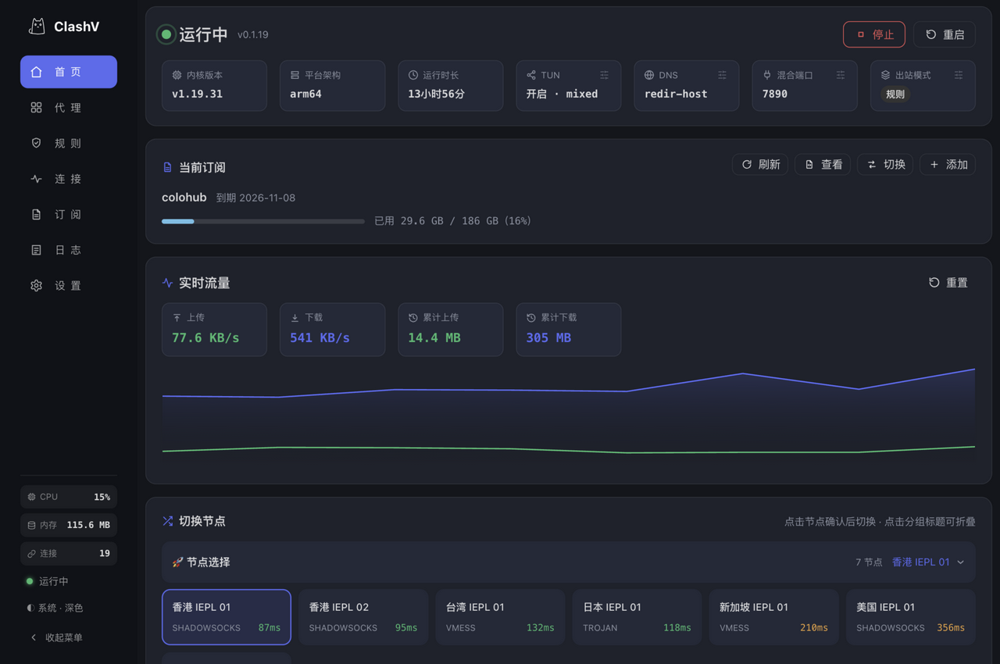
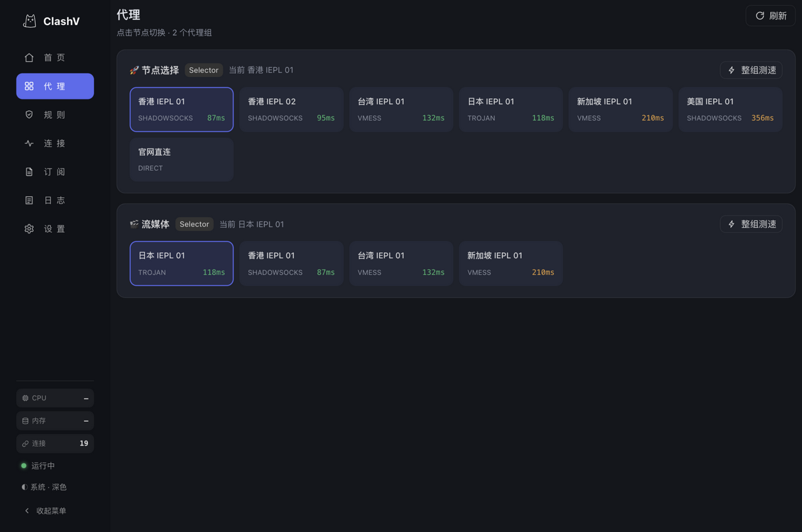
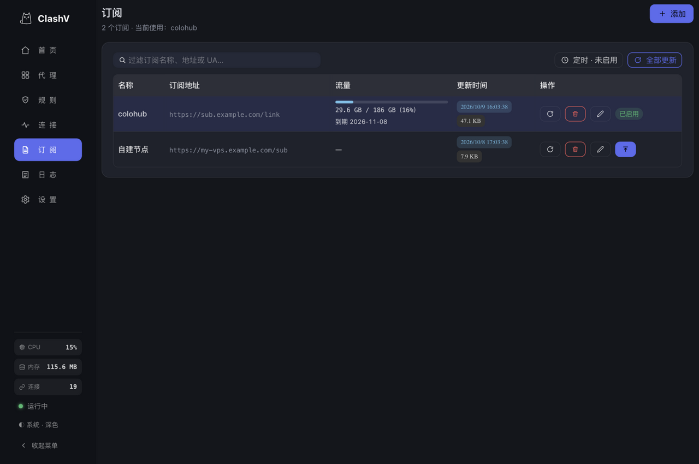
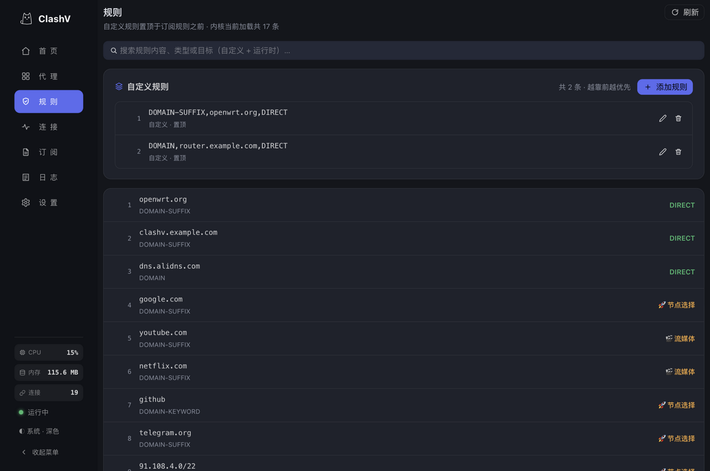
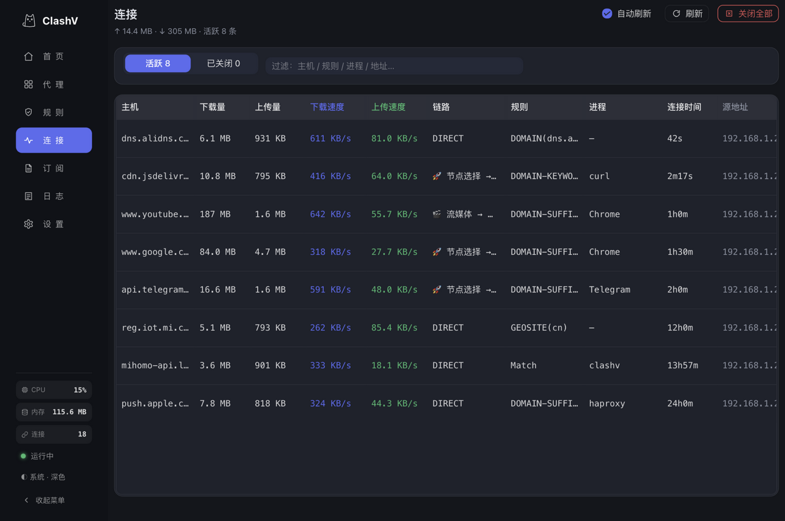
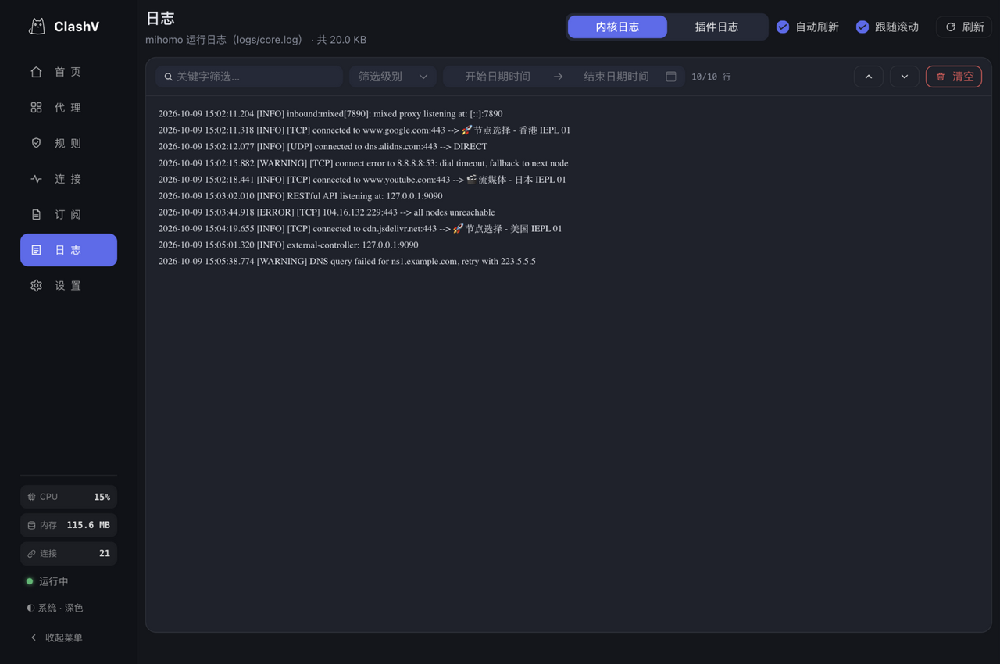
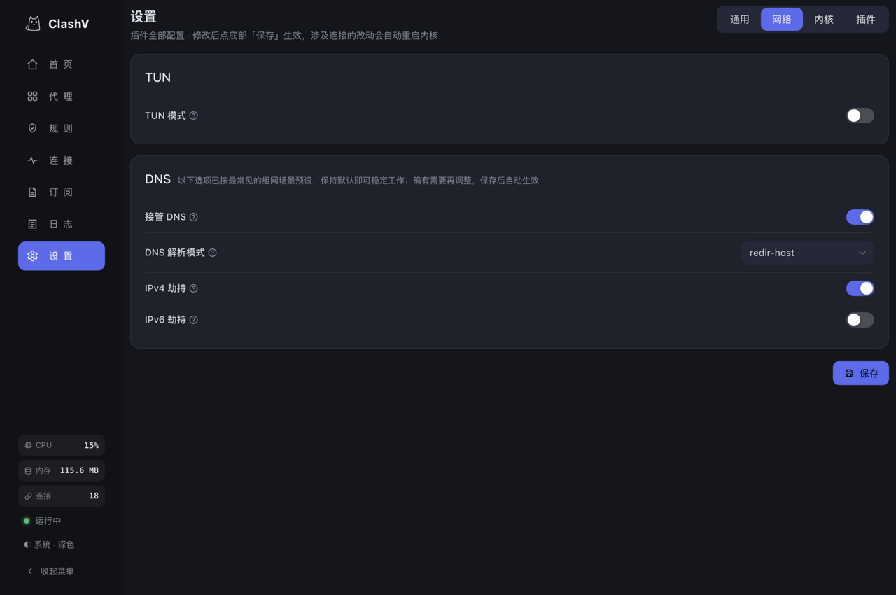
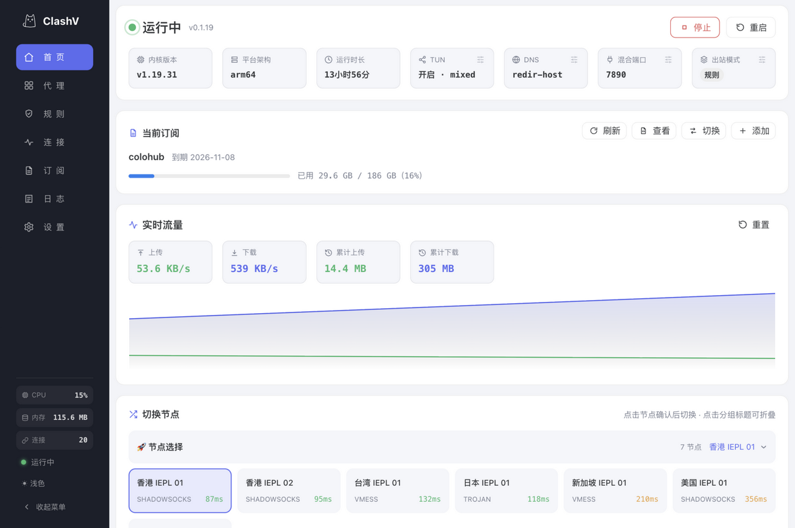

<div align="center">


# ClashV

**OpenWrt 专用的 Clash / Mihomo 管理插件**

Go 后端 + 内嵌 Web 界面，一个二进制搞定，**不玩脚本编辑那一套** —— 所有操作都是点击和选择，像 Clash Verge 一样开箱即用 🎉


</div>

## 📸 界面预览

**🏠 首页 —— 运行状态 · 快捷开关瓦片 · 实时流量曲线 · 快速切换节点**



**🌐 代理 —— 分组节点 · 点击切换 · 整组测速 · 延迟配色**



**📥 订阅 —— 表格管理 · 流量/到期展示 · 定时自动更新**



**📏 规则 —— 自定义规则置顶 · 内核运行时规则 · 搜索过滤**



**🔗 连接 —— 实时活动连接 · 命中规则/代理链/进程 · 上下行速度**



**📜 日志 —— 内核/插件双日志 · 级别与时间段筛选 · 关键字过滤**



**⚙️ 设置 —— 通用/网络/内核/插件 分区，说明收进问号弹窗**



**☀️ 浅色主题（默认跟随系统，深浅一键切换）**



## ✨ 特性

- 🏠 **首页**：运行状态、实时流量（上传/下载/连接数/内核内存）、一键启停重启、快速切换节点
- 🌐 **代理**：全部代理组与节点，点击切换，整组测速，延迟颜色分级
- 🔗 **连接日志**：内核当前活动连接实时列表（来源、目标、命中规则、代理链、上下行流量）
- 📥 **订阅**：添加/更新/启用/删除订阅，一行一条支持批量粘贴；定时自动更新；订阅内容 + 托管基础配置自动合成为运行时配置
- ⚙️ **设置**（通用 / 网络 / 内核 / 插件 分区）：
  - 🔄 内核（mihomo）一键检查更新/升级，自动识别路由器架构
  - ⬆️ 插件自更新（从 GitHub Releases 下载替换）
  - 🧦 TUN 模式（内核 auto-route 接管全局流量）；关闭时自动用防火墙接管局域网 TCP（透明代理，与 OpenClash 的 redirect 模式一致）
  - 🧭 DNS 接管（fake-ip）+ DNS 劫持（防火墙转发 / dnsmasq 转发），旁路由/网关模式开箱即用
  - 🔐 访问令牌等常用开关
- 🧩 **LuCI 集成**：安装后在 LuCI「服务 → ClashV」进入界面（iframe 内嵌，自适应撑满视口）
- 🪶 **低占用**：Go 后端约 10–20MB 内存；前端纯静态文件由 Go 直接托管，无 Node/PHP/Lua 运行时

## 🧰 技术选型

| 分层 | 选型 | 说明 |
|---|---|---|
| 后端 | **Go 1.22+** | 标准库 `net/http` 实现全部 REST API，不引 Web 框架 |
| 代理内核 | **mihomo**（Clash.Meta 内核） | 子进程托管生死与配置，浏览器永不直连内核 API |
| 前端框架 | **Vue 3 + Vue Router** | `<script setup>` 组合式 API，轻量无状态库 |
| 构建工具 | **Vite** | 开发热更新；产物 gzip ~290KB（含组件库） |
| UI 组件 | **naive-ui** + CSS 变量 | 深浅双主题（CSS 变量驱动），默认跟随系统 |
| 流量图表 | 原生 Canvas | 手绘实时曲线，零图表依赖 |
| 静态托管 | **`go:embed`** | 前端产物编译进单个二进制 |
| 配置存储 | **OpenWrt UCI** | `/etc/config/clashv`；开发机回退 `~/.clashv/config.json` |
| 透明代理 | **nftables（优先）/ iptables（兜底）** | 防火墙转发接管 LAN TCP + DNS 劫持 |
| 服务管理 | Procd（init.d） | 开机自启、子进程守护 |
| LuCI 集成 | iframe 内嵌 | 动态撑满视口高度，双层滚动免打扰 |
| 打包发布 | OpenWrt SDK + **GitHub Actions** | 双 SDK 矩阵出 ipk/apk，`PKGARCH:=all` 通吃全部架构 |

## 🏗️ 架构

```
浏览器 ──> clashv (Go, :9097) ──┬──> 内嵌静态前端 (Vue3 + Vite, embed.FS)
                                 ├──> /api/* REST 管理接口
                                 ├──> UCI 读写 (/etc/config/clashv)
                                 └──> mihomo 内核 (子进程, external-controller :9090 仅本机)
                                       └── 运行时配置 = 订阅原文 + 托管基础配置(端口/TUN/DNS)
```

- clashv 全权管理 mihomo 子进程的生死与配置；浏览器永远不直接接触内核 API
- mihomo 控制密钥自动生成，控制器只监听 `127.0.0.1`
- 端口规划：管理界面 `9097`、混合代理 `7890`、透明代理（redir）`7892`、内核 DNS `1053`、内核控制器 `127.0.0.1:9090`（均可在设置修改，透明代理端口内置）

## 📁 目录结构

```
cmd/clashv/          入口（run / version 子命令）
internal/config/     设置管理：OpenWrt 用 UCI，开发机回退 ~/.clashv/config.json
internal/profiles/   订阅下载/存储/更新（<workdir>/profiles/*.yaml + meta.json）
internal/core/       mihomo 生命周期、配置合成、控制接口客户端、流量采样、内核/插件更新
internal/api/        REST API + SPA 静态托管 + 访问令牌鉴权 + 订阅自动更新循环
internal/web/        go:embed 前端产物
web/                 Vue3 + Vite 前端源码（naive-ui 组件库，手绘 canvas 流量图）
openwrt/             OpenWrt 打包：init.d、UCI 默认配置、LuCI 菜单、SDK Makefile
scripts/             交叉编译脚本
```

## 🚀 安装到 OpenWrt

### 方式一：opkg / apk 包（推荐）

直接从 GitHub Release 下载（Actions 构建自动发布）。每个 SDK 产出 8 个包，8 包互斥、同一设备装一个即可：

- `luci-app-clashv` **通用版**：内置 7 种架构二进制（`luci-app-` 前缀表明是 LuCI 插件包），任意设备直接安装，装后自动保留当前架构
- `luci-app-clashv-<arch>` **架构精简版** ×7（arm64/armv7/mips/mipsle/amd64/riscv64/loong64）：只含单一架构二进制，包体约为通用版 1/7，装机前按设备 `DISTRIB_ARCH` 选择

```bash
# opkg 系统（OpenWrt 22.03 / 23.05）
opkg install luci-app-clashv_0.1.0-6_all.ipk
# apk 系统（OpenWrt 24.10+ / snapshot）
apk add --allow-untrusted luci-app-clashv-0.1.0-6.apk
```

安装时启动器按设备架构自动选择；mihomo 内核装完后在「设置 → 内核」里一键下载。

> 文件名后缀怎么读：ipk 是 `包名_版本-发布号_架构.ipk`，apk 是 `包名-版本-r发布号.apk`。`-8` / `-r8` 是打包发布号（`openwrt/Makefile` 的 `PKG_RELEASE`，仅打包内容变化时 +1，与代码版本号无关）；架构位统一是 `all`（安装器不校验设备 CPU 架构，好让一个包适配全部同系设备），所以架构精简版请认包名中间的架构词——`luci-app-clashv-amd64` 就是 amd64 包，与末段的 `all` 不矛盾。

> 从旧版本升级：首个发布版的包名叫 `clashv`（无前缀），安装新包前先卸载它 —— `opkg remove clashv` 或 `apk del clashv`。

自己用 SDK 打包：

```bash
# 在 OpenWrt SDK 根目录（先 make linux 产出 bin/clashv-*）
cp -r clashv package/clashv
make package/clashv/compile V=s
```

### 方式二：手动安装

```bash
# 按设备架构选一个二进制（见下方架构映射表），或装完整包让启动器自动选
scp bin/clashv-arm64 root@router:/usr/bin/clashv
ssh root@router chmod +x /usr/bin/clashv
# 内核（按设备架构从 mihomo Releases 下载 .gz 解压，或装好后走界面下载）
scp mihomo-linux-arm64 root@router:/usr/bin/mihomo && ssh root@router chmod +x /usr/bin/mihomo
# 配套文件
scp -r openwrt/root/etc root@router:/ && scp -r openwrt/root/usr root@router:/ && scp -r openwrt/root/www root@router:/
ssh root@router "/etc/uci-defaults/99-clashv; /etc/init.d/clashv start"
```

安装完成后：

- LuCI → 服务 → ClashV；直接访问 `http://<路由器IP>:9097` 会自动跳转到该页（需已登录 OpenWrt，退出路由器登录后界面同步失效）
- 首次使用：订阅页添加订阅 → 启用 → 首页启动内核

### 架构映射表

启动器与 postinst 用同一套逻辑（可用 `OCA_ARCH_OVERRIDE` 强制指定）：

| OpenWrt DISTRIB_ARCH | 内置二进制 |
|---|---|
| aarch64* / arm64* | clashv-arm64 |
| arm*（cortex-a7/a9 等） | clashv-armv7 |
| mipsel*（24kc/74kc…） | clashv-mipsle |
| mips*（24kc/mips32…） | clashv-mips |
| x86_64 | clashv-amd64 |
| riscv64 | clashv-riscv64 |
| loongarch64 | clashv-loong64 |

## 🛠️ 本地开发

依赖：Go 1.22+、Node 18+

```bash
make dev          # 后端跑在 :9097（文件存储模式，数据在 ~/.clashv）
cd web && npm run dev   # 前端热更新，:5173，/api 自动代理到 9097
```

配合本地内核测试：

```bash
# 1. 放一个 mihomo 二进制（或 make linux 后改 core_path 指向产物）
mkdir -p ~/.clashv/bin && cp mihomo-darwin-arm64 ~/.clashv/bin/mihomo && chmod +x ~/.clashv/bin/mihomo
# 2. 起个假订阅
make test-sub     # http://127.0.0.1:8899/sub.yaml
# 3. 打开 http://127.0.0.1:9097 「订阅」页添加上面的地址，启用即可
```

## 📦 构建与打包

本机构建：

```bash
make build        # 本机二进制 bin/clashv（内嵌前端）
make linux        # 交叉编译 7 种 Linux 架构 bin/clashv-{arm64,armv7,mips,mipsle,amd64,riscv64,loong64}
```

本地 Docker 打包（与 CI 一致），产物输出到 `build/` 目录（已 gitignore）：

```bash
./scripts/build-local-docker.sh            # 构建 ipk + apk
./scripts/build-local-docker.sh ipk        # 只构建 ipk（opkg 系统 22.03/23.05）
./scripts/build-local-docker.sh apk        # 只构建 apk（OpenWrt 24.10+/snapshot）
./scripts/build-local-docker.sh --shell    # 进入构建容器手动排查
```

- 流水线脚本 `scripts/ci-build.sh` 由 CI 与本地共用（前端 → Go 多架构 → 下载 SDK → 打包），本地能过 CI 大概率能过
- 容器固定 linux/amd64，与 Actions 运行器同架构（OrbStack 走 Rosetta）；首次要构建镜像 + 下载 SDK（约 200MB+），之后有缓存会快很多

### 打包发布（GitHub Actions）

**推 tag 才触发构建**（push master 不出包），一键发版唯一入口是 `scripts/release.sh`：

```bash
./scripts/release.sh            # 升 patch 版本号（默认），如 0.1.0 → 0.1.1
./scripts/release.sh minor      # 升 minor：0.1.0 → 0.2.0
./scripts/release.sh major      # 升 major：0.1.0 → 1.0.0
./scripts/release.sh 0.3.0      # 直接指定版本号
./scripts/release.sh --dry-run  # 只预览要做什么，不改任何文件
```

脚本自动完成：同步升级 4 处版本号（`openwrt/Makefile` 的 `PKG_VERSION`、根 `Makefile` 的 `VERSION`、`web/package.json` 与 lock 文件）→ 提交 → 打 tag `v<版本>` → 推送 master + tag，推送 tag 即触发 Actions 打包并发布 GitHub Release。遇到以下情况会直接拦截、不做任何改动：工作区有未提交改动、新版本号与当前相同、本地或远端已存在同版本 tag。

`.github/workflows/compile_packages.yml`（参照 OpenClash 的方案）：

- **单包全平台 + 7 架构精简版**：`luci-app-clashv` 为 `PKGARCH:=all`，内含 7 种架构的 Go 二进制，安装后 `/usr/bin/clashv` 启动器按设备 `DISTRIB_ARCH` 自动选择执行，`postinst` 删除其余架构（安装后仅占 7~9MB，包体约 22MB）；另出 7 个架构精简版 `luci-app-clashv-<arch>`，8 包互相 CONFLICTS
- 双 SDK matrix：22.03 SDK 出 **ipk**（OpenWrt 22.03/23.05，opkg）、snapshot SDK 出 **apk**（OpenWrt 24.10+/snapshot）
- 触发方式：推 `v*` tag，或 Actions 页面手动 Run workflow；构建时校验 tag 名与 `openwrt/Makefile` 的 `PKG_VERSION` 一致，不一致直接报错拦下

## 📡 API 一览（供二开）

| 方法 | 路径 | 说明 |
|---|---|---|
| GET | /api/status | 运行状态、版本、当前订阅 |
| GET | /api/traffic | 实时流量快照（前端 1s 轮询） |
| GET/PUT | /api/settings | 读写设置 |
| GET | /api/proxies | 全部代理与分组（透传内核） |
| PUT | /api/proxies/{group} | 切换节点 `{"name":"..."}` |
| GET | /api/proxies/{name}/delay | 单节点测速 |
| GET | /api/group/{name}/delay | 整组测速 |
| GET | /api/connections | 当前活动连接（连接日志） |
| GET/POST | /api/profiles | 订阅列表/添加 |
| POST | /api/profiles/{id}/update·activate | 更新/启用订阅 |
| DELETE | /api/profiles/{id} | 删除订阅 |
| POST | /api/core/start·stop·restart | 内核控制 |
| GET/POST | /api/core/latest·upgrade | 内核检查更新/升级 |
| GET/POST | /api/plugin/latest·upgrade | 插件检查更新/升级 |
| POST | /api/service/restart | 重启服务（OpenWrt） |

设置令牌后，非本机的 API 请求需带 `X-Clashv-Token` 头（页面上首次访问会弹框输入，自动重试）。

## ⚠️ 使用注意

- 📌 **代理生效**：其他设备把**网关和 DNS** 指向本路由器 IP 即可，插件启动内核后自动接管（防火墙 DNS 劫持 + TCP 透明代理）；局域网设备也可手动把代理设为 `<路由器IP>:7890`。开启「TUN 模式」后路由器自身流量也被接管（依赖 `kmod-tun`）
- 🧭 **DNS**：TUN 模式建议保持「接管 DNS」开启（fake-ip）；非 TUN 模式默认「防火墙转发」劫持 LAN 的 53 端口到内核 DNS，dnsmasq 联动可在设置中切换为「dnsmasq 转发」
- 🔍 **架构识别**：内核更新默认按 Go 运行时推导 mihomo 平台名，MIPS 硬浮点等特殊设备在「设置 → 平台」手动填（如 `linux-mips-hardfloat`）
- 🔐 **安全**：默认开启「OpenWrt 登录校验」——必须先登录 LuCI 才能打开界面，直连 9097 会自动跳到 LuCI 登录；可另在「设置 → 代理基础」配置访问令牌保护 API；控制器仅监听本机，外部无法直连内核
- 💾 **配置持久化**：设置存 UCI（`/etc/config/clashv`），订阅存 `/etc/clashv/profiles/`，两者都在 conffiles 列表中，升级不丢

## 📜 免责声明

> [!IMPORTANT]
> 下载、安装或使用本插件，即视为你已阅读并同意本声明的全部内容。如不同意，请立即停止使用并删除本插件。

1. **爱国守法**：作者热爱祖国，拥护国家利益，严格遵守中华人民共和国各项法律法规。本插件仅基于开源的 mihomo 内核做管理封装，供个人在合法合规前提下学习网络技术与自建网络管理使用。
2. **用途限制**：本插件不提供、不内置任何订阅链接、节点服务器或机场服务，也不含任何预置配置。使用者应确保自己的使用行为符合所在国家/地区的法律法规，**严禁**将本插件用于任何违法违规用途。
3. **责任自负**：因使用者下载、安装、配置、使用本插件及其关联的第三方订阅服务、节点服务而产生的一切行为与后果 —— 包括但不限于第三方法律纠纷、行政处罚、账号或财产损失、数据丢失或破坏 —— **均由使用者本人自行承担，与作者无关**，作者不承担任何直接或间接责任。
4. **无担保**：本插件按「现状」提供，不附带任何明示或默示的担保。作者不保证功能不中断、无错误或适合任何特定用途，使用风险完全由使用者自行评估与承担。
5. **侵权处理**：本项目引用的第三方组件版权归原作者所有；若本项目内容侵犯了您的合法权益，请通过 Issue 联系，作者将第一时间核实并处理。

## 🙏 鸣谢

本项目从以下优秀的开源项目中获得了灵感与设计启发，特此感谢：

- [mihomo](https://github.com/MetaCubeX/mihomo) —— 强大的代理内核，本插件所管理的核心
- [OpenClash](https://github.com/vernesong/OpenClash) —— OpenWrt 代理插件的先行者，打包与集成方案多有参考
- [Clash Verge Rev](https://github.com/clash-verge-rev/clash-verge-rev) —— 桌面端的优秀实践，界面交互设计的灵感来源

## 📄 License

[MIT](LICENSE)
