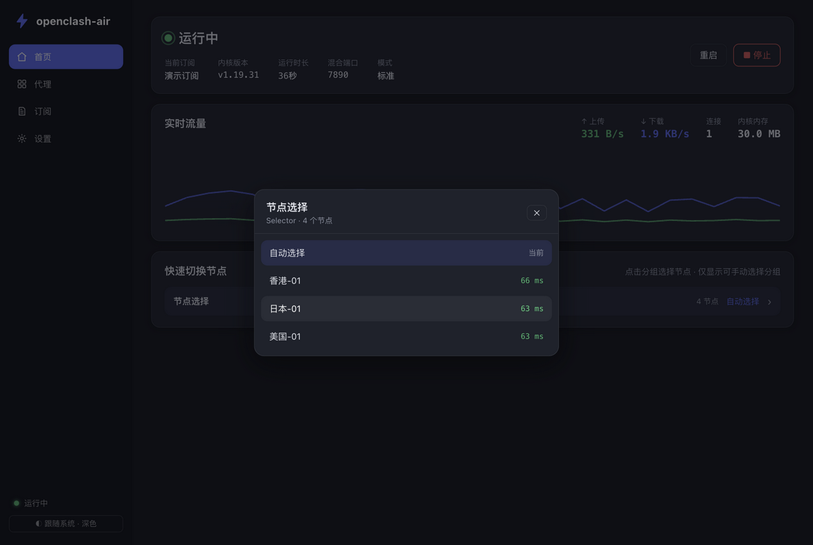

# openclash-air

OpenWrt 专用的 Clash/Mihomo 管理插件。Go 后端 + 内嵌 Web 界面，一个二进制搞定，**不玩脚本编辑那一套**——所有操作都是点击和选择，像 Clash Verge 一样开箱即用。

## 界面预览

| 首页：状态 / 实时流量 / 快速切换 | 代理：分组节点 / 点击切换 / 整组测速 |
|---|---|
|  |  |
| **节点切换弹窗（带延迟）** | **订阅管理** |
|  |  |
| **设置：内核与插件更新 / TUN / 访问控制** | **浅色主题（默认跟随系统）** |
|  |  |

## 特性

- **首页**：运行状态、实时流量（上传/下载/连接数/内核内存）、一键启停重启、快速切换节点
- **代理**：全部代理组与节点，点击切换，整组测速，延迟颜色分级
- **订阅**：添加/更新/启用/删除订阅，支持定时自动更新；订阅内容 + 托管基础配置自动合成为运行时配置
- **设置**：
  - 内核（mihomo）一键检查更新/升级，自动识别路由器架构
  - 插件自更新（从 GitHub Releases 下载替换）
  - 端口、允许局域网、TUN 模式、DNS 接管、访问令牌等常用开关
- **LuCI 集成**：安装后在 LuCI「服务 → openclash-air」进入界面（iframe 内嵌）
- **低占用**：Go 后端约 10–20MB 内存；前端打包后仅 ~51KB gzip，纯静态文件由 Go 直接托管，无 Node/PHP/Lua 运行时

## 架构

```
浏览器 ──> openclash-air (Go, :9097) ──┬──> 内嵌静态前端 (Vue3 + Vite, embed.FS)
                                 ├──> /api/* REST 管理接口
                                 ├──> UCI 读写 (/etc/config/openclash-air)
                                 └──> mihomo 内核 (子进程, external-controller :9090 仅本机)
                                       └── 运行时配置 = 订阅原文 + 托管基础配置(端口/TUN/DNS)
```

- openclash-air 全权管理 mihomo 子进程的生死与配置；浏览器永远不直接接触内核 API
- mihomo 控制密钥自动生成，控制器只监听 `127.0.0.1`
- 端口规划：管理界面 `9097`、混合代理 `7890`、内核控制器 `127.0.0.1:9090`（均可在设置修改）

## 目录结构

```
cmd/openclash-air/          入口（run / version 子命令）
internal/config/      设置管理：OpenWrt 用 UCI，开发机回退 ~/.openclash-air/config.json
internal/profiles/    订阅下载/存储/更新（<workdir>/profiles/*.yaml + meta.json）
internal/core/        mihomo 生命周期、配置合成、控制接口客户端、流量采样、内核/插件更新
internal/api/         REST API + SPA 静态托管 + 访问令牌鉴权 + 订阅自动更新循环
internal/web/         go:embed 前端产物
web/                  Vue3 + Vite 前端源码（无重型 UI 框架，手绘 canvas 流量图）
openwrt/              OpenWrt 打包：init.d、UCI 默认配置、LuCI 菜单、SDK Makefile
scripts/              交叉编译脚本
```

## 本地开发

依赖：Go 1.22+、Node 18+

```bash
make dev          # 后端跑在 :9097（文件存储模式，数据在 ~/.openclash-air）
cd web && npm run dev   # 前端热更新，:5173，/api 自动代理到 9097
```

配合本地内核测试：

```bash
# 1. 放一个 mihomo 二进制（或 make linux 后改 core_path 指向产物）
mkdir -p ~/.openclash-air/bin && cp mihomo-darwin-arm64 ~/.openclash-air/bin/mihomo && chmod +x ~/.openclash-air/bin/mihomo
# 2. 起个假订阅
make test-sub     # http://127.0.0.1:8899/sub.yaml
# 3. 打开 http://127.0.0.1:9097 「订阅」页添加上面的地址，启用即可
```

## 构建

```bash
make build        # 本机二进制 bin/openclash-air（内嵌前端）
make linux        # 交叉编译 7 种 Linux 架构 bin/openclash-air-{arm64,armv7,mips,mipsle,amd64,riscv64,loong64}
```

## 本地打包（Docker，与 CI 一致）

推送前可在本地 Docker（OrbStack / Docker Desktop）里跑与 GitHub Actions 完全相同的流水线，产物输出到 `build/` 目录（已 gitignore）：

```bash
./scripts/build-local-docker.sh            # 构建 ipk + apk
./scripts/build-local-docker.sh ipk        # 只构建 ipk（opkg 系统 22.03/23.05）
./scripts/build-local-docker.sh apk        # 只构建 apk（OpenWrt 24.10+/snapshot）
./scripts/build-local-docker.sh --shell    # 进入构建容器手动排查
```

- 流水线脚本 `scripts/ci-build.sh` 由 CI 与本地共用（前端 → Go 多架构 → 下载 SDK → 打包），本地能过 CI 大概率能过
- 容器固定 linux/amd64，与 Actions 运行器同架构（OrbStack 走 Rosetta）；首次要构建镜像 + 下载 SDK（约 200MB+），之后有缓存会快很多

## 打包发布（GitHub Actions）

`.github/workflows/compile_packages.yml`（参照 OpenClash 的方案）：

- 一份 **`PKGARCH:=all` 的包通用所有平台**：内含 7 种架构的 Go 二进制，
  安装后 `/usr/bin/openclash-air` 启动器按设备 `DISTRIB_ARCH` 自动选择执行，
  `postinst` 删除其余架构（安装后仅占 7~9MB，包体约 22MB）
- 双 SDK matrix：22.03 SDK 出 **ipk**（OpenWrt 22.03/23.05，opkg）、snapshot SDK 出 **apk**（OpenWrt 24.10+/snapshot）
- push 到 master 或手动触发即构建；产物上传 Artifacts 并自动发 GitHub Release（tag = `v<PKG_VERSION>`，版本号取自 `openwrt/Makefile`）

架构映射表（启动器与 postinst 同一套逻辑，可用 `OCA_ARCH_OVERRIDE` 强制指定）：

| OpenWrt DISTRIB_ARCH | 内置二进制 |
|---|---|
| aarch64* / arm64* | openclash-air-arm64 |
| arm*（cortex-a7/a9 等） | openclash-air-armv7 |
| mipsel*（24kc/74kc…） | openclash-air-mipsle |
| mips*（24kc/mips32…） | openclash-air-mips |
| x86_64 | openclash-air-amd64 |
| riscv64 | openclash-air-riscv64 |
| loongarch64 | openclash-air-loong64 |

## 安装到 OpenWrt

### 方式一：opkg / apk 包（推荐）

直接从 GitHub Release 下载（Actions 构建自动发布）：

```bash
# opkg 系统（OpenWrt 22.03 / 23.05）
opkg install openclash-air_0.1.0-1_all.ipk
# apk 系统（OpenWrt 24.10+ / snapshot）
apk add --allow-untrusted openclash-air-0.1.0-1.apk
```

任意架构通用，无需挑版本；mihomo 内核装完后在「设置 → 内核」里一键下载。

自己用 SDK 打包：

```bash
# 在 OpenWrt SDK 根目录（先 make linux 产出 bin/openclash-air-*）
cp -r openclash-air package/openclash-air
make package/openclash-air/compile V=s
```

### 方式二：手动安装

```bash
# 按设备架构选一个二进制（见上方架构映射表），或装完整包让启动器自动选
scp bin/openclash-air-arm64 root@router:/usr/bin/openclash-air
ssh root@router chmod +x /usr/bin/openclash-air
# 内核（按设备架构从 mihomo Releases 下载 .gz 解压，或装好后走界面下载）
scp mihomo-linux-arm64 root@router:/usr/bin/mihomo && ssh root@router chmod +x /usr/bin/mihomo
# 配套文件
scp -r openwrt/root/etc root@router:/ && scp -r openwrt/root/usr root@router:/ && scp -r openwrt/root/www root@router:/
ssh root@router "/etc/uci-defaults/99-openclash-air; /etc/init.d/openclash-air start"
```

安装完成后：

- LuCI → 服务 → openclash-air，或直接访问 `http://<路由器IP>:9097`
- 首次使用：订阅页添加订阅 → 启用 → 首页启动内核

## 使用注意

- **代理生效**：其他设备把网关/代理指向路由器 `:7890` 即可；开启「TUN 模式」后路由器自身流量也被接管（依赖 `kmod-tun`），无需配 iptables
- **DNS**：TUN 模式建议保持「接管 DNS」开启（fake-ip）；如需 dnsmasq 联动，把 dnsmasq 上游转发到 `127.0.0.1:1053` 即可，插件不做强制
- **架构识别**：内核更新默认按 Go 运行时推导 mihomo 平台名，MIPS 硬浮点等特殊设备在「设置 → 平台」手动填（如 `linux-mips-hardfloat`）
- **安全**：界面默认局域网开放；建议在「设置 → 访问控制」配置访问令牌；控制器仅监听本机，外部无法直连内核
- **配置持久化**：设置存 UCI（`/etc/config/openclash-air`），订阅存 `/etc/openclash-air/profiles/`，两者都在 conffiles 列表中，升级不丢

## API 一览（供二开）

| 方法 | 路径 | 说明 |
|---|---|---|
| GET | /api/status | 运行状态、版本、当前订阅 |
| GET | /api/traffic | 实时流量快照（前端 1s 轮询） |
| GET/PUT | /api/settings | 读写设置 |
| GET | /api/proxies | 全部代理与分组（透传内核） |
| PUT | /api/proxies/{group} | 切换节点 `{"name":"..."}` |
| GET | /api/proxies/{group}/delay | 整组测速 |
| POST | /api/proxies/{name}/delay | 单节点测速 |
| GET/POST | /api/profiles | 订阅列表/添加 |
| POST | /api/profiles/{id}/update·activate | 更新/启用订阅 |
| DELETE | /api/profiles/{id} | 删除订阅 |
| POST | /api/core/start·stop·restart | 内核控制 |
| GET/POST | /api/core/latest·upgrade | 内核检查更新/升级 |
| GET/POST | /api/plugin/latest·upgrade | 插件检查更新/升级 |
| POST | /api/service/restart | 重启服务（OpenWrt） |

设置令牌后，非本机请求需带 `X-Openclash-Air-Token` 头。

## License

MIT
